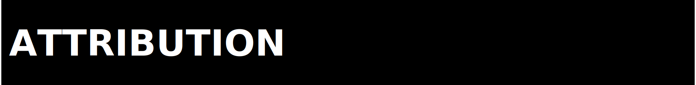

  

  

We expect participation in ZPE Prosody to stay professional, respectful, and
evidence-led. This repo is a private staging surface with a falsification-first
culture, so honesty about limits and failures is part of the conduct standard.

---

  

Expected behavior:

- Respect other contributors and reviewers.
- Give evidence-backed feedback.
- Preserve negative results instead of hiding them.
- Challenge claims with artifacts, not rhetoric.
- Keep repo-boundary and authority-language discipline intact.

Unacceptable behavior:

- Harassment or discrimination.
- Bad-faith technical argument without counter-evidence.
- Claim inflation beyond the artifact trail.
- Attempts to smuggle unrelated material or hidden data into the repo.

---

  

This code of conduct applies to issues, pull requests, review comments,
maintainer decisions, documentation edits, and any other collaboration around
the repository.

---

  

Report conduct issues privately to:

- `architects@zer0pa.ai`

Maintainers may remove content or restrict participation when conduct harms the
integrity of the repo or its proof surface.

---

  

This repository-specific policy is aligned to Zer0pa evidence-governance norms
and adapted for the Prosody private staging boundary.
