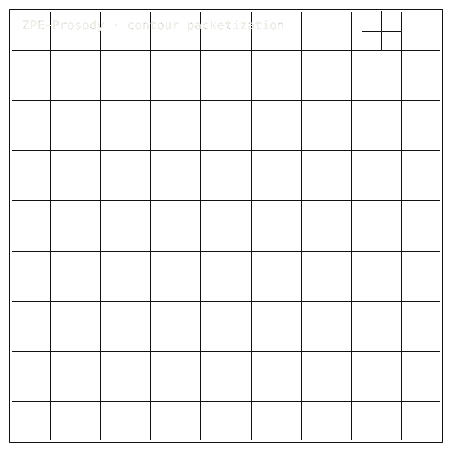

# ZPE-Prosody

## Install / Developer Commands

#### Quick Start

```bash
python -m venv .venv
source .venv/bin/activate
python -m pip install -e ".[dev]"
make repo-sanity
make package-sanity
make test
```

Optional API wrapper dependency:

```bash
python -m pip install ".[api]"
```

The base wheel ships only `src/zpe_prosody`. No CLI or historical gate harness is packaged as a runtime contract. Read [docs/LEGAL_BOUNDARIES.md](docs/LEGAL_BOUNDARIES.md) before widening any claim from this repo state.

<table width="100%">
<tr>
<td width="100%" valign="top">
<p></p>
<h2><code>00</code> ZPE-PROSODY · CONTOUR CODEC</h2>
<p><strong>PR #50 DRAFT · BRANCH-PUBLIC</strong></p>
      <h1>Speech's Shape and <span>Feeling Encoded</span></h1>
      <p>Prosodic feature-store codec &mdash; pitch, energy, duration, voiced mask &middot; ZPE-Prosody &middot; PyPI <em>zpe-prosody</em> v0.1.1 &middot; github.com/Zer0pa/ZPE-Prosody</p>
      <p>A voice carries more than words. Pitch rises into a question, stress lands hard on a single syllable, rhythm tells a listener whether the speaker is calm or in a hurry. ZPE-Prosody captures that shape as a deterministic <em>ZPRS/v1</em> stream &mdash; F0, energy, duration, and the voiced/unvoiced mask &mdash; at <strong>13.0&times;</strong> mean compression and <strong>0.64% voiced-F0 RMSE</strong> on 100 LibriSpeech test-clean utterances. The encoder is the product. Retrieval misses target; transfer is paused. Both limits are named, not buried.</p>
</td>
</tr>
</table>

<table width="100%">
<tr>
<td width="100%" valign="top" align="center">
<figure>
        <div></div>
        <figcaption><b>Scope:</b> encoder stream for F0, energy, duration, and voiced mask. Retrieval misses target; transfer remains paused.</figcaption>
      </figure>
</td>
</tr>
</table>

<table width="100%">
<tr>
<td width="62%" valign="top">
<h2><code>02</code> MARKETS</h2>
<p><strong>ADJACENT FORECASTS</strong></p>
      <div>
        <div>
          <div><span>Speech and language processing '30</span> <span></span> <span>$26.8B</span></div>
          <div><span>Text-to-speech market '31</span> <span></span> <span>$7.9B</span></div>
          <div><span>Text-to-speech software '30</span> <span></span> <span>$7.3B</span></div>
          <div><span>Voice analytics '30</span> <span></span> <span>est. $3.1B</span></div>
          <div><span>Speech AI / feature-store tooling '30</span> <span></span> <span>est. $1.8B</span></div>
        </div>
      </div>
      <div>Adjacent forecasts only &middot; ZPE-Prosody is a bounded prosodic encoder; retrieval and transfer are not claimed.</div>
</td>
<td width="38%" valign="top">
<h2><code>03</code> VALUE</h2>
      <div>$7.3<span>B</span></div>
      <div>TTS market by 2030; the prosodic feature store beneath it, with the retrieval gap stated.</div>
</td>
</tr>
</table>

<table width="100%">
<tr>
<td width="100%" valign="top">
<p></p>
<h2><code>04</code> INSIGHT</h2>
      <h2>Speech carries feeling. Its shape <span>can now be held.</span></h2>
</td>
</tr>
</table>

<table width="100%">
<tr>
<td width="50%" valign="top">
<h4><code>05.1</code> CURRENT TECH</h4>
<p><strong>COMPUTED AND DISCARDED</strong></p>
        <p>Mainstream TTS and voice-analytics stacks compute pitch, energy and timing every time they need them, then throw the contours away or stash them as undocumented bytes. No published fidelity figure, no public limit, no shared archive format.</p>
</td>
<td width="50%" valign="top">
<h4><code>05.2</code> OUR TECH</h4>
<p><strong>THE SHAPE, HELD</strong></p>
        <p>ZPE-Prosody encodes the four prosodic primitives &mdash; F0, energy, duration, voiced mask &mdash; as a deterministic <em>ZPRS/v1</em> stream at <strong>13.0&times;</strong> mean compression and <strong>0.64% voiced-F0 RMSE</strong> on real LibriSpeech utterances, with mean encode latency of <strong>2.67 ms</strong>. Four primitive checks pass. Retrieval and transfer are excluded from the product on purpose, with the numbers.</p>
</td>
</tr>
</table>

<table width="100%">
<tr>
<td width="100%" valign="top">
<p></p>
<h3><code>05.3</code> BENCHMARKS</h3>
<p><strong>LIBRISPEECH TEST-CLEAN</strong></p>
      <div>
        <div>
          <div><span>Compression</span> <b>13.0</b> <small>&times;</small> </div>
          <div><span>F0 RMSE</span> <b>0.64</b> <small>%</small> </div>
          <div><span>Primitive</span> <b>4/4</b> <small>PASS</small> </div>
          <div><span>Retrieval</span> <b>MISS</b> <small>p@5 0.31</small> </div>
        </div>
        <div>
          <div><span>Encoder 13.0&times;</span> <span></span> <span>PASS</span></div>
          <div><span>Fidelity 0.64%</span> <span></span> <span>PASS</span></div>
          <div><span>Retrieval 0.31</span> <span></span> <span>MISS</span></div>
        </div>
      </div>
      <div><b>Scope:</b> 100 LibriSpeech test-clean utterances. PRO-C006 retrieval MISS; PRO-C005 transfer PAUSED_EXTERNAL.</div>
</td>
</tr>
</table>

<table width="100%">
<tr>
<td width="34%" valign="top">
<h2><code>06</code> MEASUREMENT</h2>
<p><strong>PRO CHECK SUITE</strong></p>
      <h2>The encoder passes four checks. Retrieval and transfer <span>do not.</span></h2>
</td>
<td width="66%" valign="top">
<h3><code>06.1</code> COMPARATIVE PERFORMANCE · LIBRISPEECH CONTOUR COMPRESSION</h3>
      <div>
        <div>
          <div><span>ZPE-Prosody</span> <span></span> <span>13.0&times; compression</span></div>
          <div><span>gzip</span> <span></span> <span>~2.2&times; raw</span></div>
          <div><span>PRO-C006 p@5</span> <span></span> <span>0.31 MISS</span></div>
          <div><span>PRO-C004</span> <span></span> <span>PASS</span></div>
        </div>
      </div>
      <div>100 LibriSpeech <em>test-clean</em> utterances. The four primitive encoder checks pass. Retrieval misses at p@5 <strong>0.31 vs 0.80</strong>; OOD p@5 0.1707. Transfer is paused; no commercial-safe substitute proven in-lane.</div>
</td>
</tr>
</table>

<table width="100%">
<tr>
<td width="100%" valign="top">
<p></p>
<h2><code>07</code> KEY METRICS</h2>
<p><strong>LIBRISPEECH TEST-CLEAN</strong></p>
</td>
</tr>
</table>

<table width="100%">
<tr>
<td width="20%" valign="top">
<p><strong><code>07.1</code><br><small>F0 RMSE</small></strong></p>
      <div><strong>0.64</strong><br><small>%</small></div>
      <div>Voiced frames &middot; <b>LibriSpeech 100 utterances</b></div>
</td>
<td width="20%" valign="top">
<p><strong><code>07.2</code><br><small>COMPRESSION</small></strong></p>
      <div><strong>13.0</strong><br><small>×</small></div>
      <div>Mean vs raw float32 · <b>ZPRS/v1 stream</b></div>
</td>
<td width="20%" valign="top">
<p><strong><code>07.3</code><br><small>PRIMITIVE<br>CHECKS</small></strong></p>
      <div><strong>4 / 4</strong><br><small>PASS</small></div>
      <div>PRO-C001..C004 only · <b>retrieval open</b></div>
</td>
<td width="20%" valign="top">
<p><strong><code>07.4</code><br><small>CORPUS</small></strong></p>
      <div><strong>100</strong><br><small>utt</small></div>
      <div>LibriSpeech test-clean · <b>OpenSLR</b></div>
</td>
<td width="20%" valign="top">
<p><strong><code>07.5</code><br><small>RETRIEVAL<br>TARGET</small></strong></p>
      <div><strong>0.31</strong><br><small>p@5</small></div>
      <div>PRO-C006 MISS · <b>vs 0.80 threshold</b></div>
</td>
</tr>
</table>

<table width="100%">
<tr>
<td width="40%" valign="top">
<h2><code>08</code> ENCODER BOUNDS</h2>
<p><strong>WHAT HOLDS, WHAT MISSES</strong></p>
      <h2>The encoder holds speech's shape. Retrieval does <span>not yet follow.</span></h2>
</td>
<td width="60%" valign="top">
<h4><code>08.1</code> WHAT ROUND-TRIPS EXACTLY</h4>
<p><strong>ZPRS/V1 PRIMITIVE</strong></p>
      <p>On 100 LibriSpeech <em>test-clean</em> utterances the encoder records <strong>13.0&times;</strong> mean compression at <strong>0.64% voiced-F0 RMSE</strong> with duration RMSE of 0.000 ms, across <strong>5/5 hash-identical encoder runs</strong>. The same input bytes produce the same ZPRS/v1 stream every time, on every host. PRO-C001..C004 PASS on primitive encoder checks; they do not override the retrieval and transfer gates. Retrieval (PRO-C006) misses target at p@5 <strong>0.31 vs 0.80</strong>; OOD p@5 0.1707. Transfer (PRO-C005) is PAUSED_EXTERNAL. The page reports both, not one.</p>
</td>
</tr>
</table>

<table width="100%">
<tr>
<td width="100%" valign="top">
<p></p>
<h3><code>08.2</code> HONEST BLOCKER</h3>
      <span>Honest Blocker ·</span>
      <p><strong>MISS on PRO-C006 retrieval</strong>, <em>p@5 0.31</em> vs 0.80; OOD p@5 0.1707. <strong>PRO-C005 transfer</strong> PAUSED_EXTERNAL; no commercial-safe substitute proven in-lane. Status packet on <strong>PR #50 branch-public</strong>; PyPI stale at v0.1.1. <em>No transfer learning, retrieval product, or TTS-ready system is claimed.</em></p>
</td>
</tr>
</table>

<table width="100%">
<tr>
<td width="66%" valign="top">
<h2><code>09</code></h2>
      <h2>A VOICE WITH A <span>FIDELITY RECEIPT.</span></h2>
</td>
<td width="34%" valign="top">
<h4><code>09.1</code> THE AMBITION</h4>
      <p>The product is a bounded <em>ZPRS/v1</em> feature store for the shape of speech &mdash; F0, energy, duration, voiced mask &mdash; that a TTS team, a call-centre analytics owner or a linguistics lab can store, ship and re-read with a stated fidelity per recording. Retrieval and transfer arrive later, on their own terms.</p>
</td>
</tr>
</table>

<table width="100%">
<tr>
<td width="50%" valign="top">
<h4><code>09.2</code> WHAT WORKS NOW</h4>
        <h2>The prosodic encoder ships with a fidelity number per frame and a public compression figure.</h2>
</td>
<td width="50%" valign="top">
<h4><code>09.3</code> WHAT'S STILL OPEN</h4>
        <h2>Retrieval misses target at p@5 0.31 vs 0.80. Transfer is paused on an external dependency.</h2>
</td>
</tr>
</table>

<table width="100%">
<tr>
<td width="25%" valign="top">
<p><strong><code>09.4</code><br><small>FEATURE STORES</small></strong></p>
<p><strong>NEAR-TERM (12–24 MO)</strong></p>
      <div>TTS teams stop drowning in contour bytes</div><div>A TTS platform keeping pitch and energy contours for thousands of speaker voices and styles cuts feature-store storage by roughly 87% against its current gzip baseline. The same archive holds many more voices on the same disk.</div>
</td>
<td width="25%" valign="top">
<p><strong><code>09.5</code><br><small>FIDELITY</small></strong></p>
<p><strong>NEAR-TERM (12–24 MO)</strong></p>
      <div>Voice pipelines inherit a pitch receipt</div><div>A voice-cloning engineer who round-trips a speaker through the codec sees the F0 error per utterance &mdash; 0.64% on LibriSpeech &mdash; before the model ever ingests the contour. Pitch drift becomes a number on a dashboard, not a complaint from a listener.</div>
</td>
<td width="25%" valign="top">
<p><strong><code>09.6</code><br><small>CALL CENTRES</small></strong></p>
<p><strong>MID-TERM (24–48 MO)</strong></p>
      <div>Analytics vendors archive prosody, not just transcripts</div><div>A call-centre analytics platform that already stores transcripts can store the prosody beside them at a tractable cost. Emotion-AI and sentiment systems get to work from the actual shape of how a customer spoke, not a downstream summary of it.</div>
</td>
<td width="25%" valign="top">
<p><strong><code>09.7</code><br><small>LINGUISTICS</small></strong></p>
<p><strong>MID-TERM (24–48 MO)</strong></p>
      <div>Prosody corpora become comparable</div><div>A linguistics lab studying stress and intonation across dialects can compress a multi-year recording corpus into a portable feature store with a stated pitch error. A peer at another institution can reproduce the analysis on the same bytes, not on a re-derived contour.</div>
</td>
</tr>
</table>

<table width="100%">
<tr>
<td width="100%" valign="top">
<p></p>
<p><strong><code>09.8</code><br><small>DISCLOSURE</small></strong></p>
<p><strong>PARADIGM (48 MO+)</strong></p>
      <div>Speech feature codecs get fidelity terms</div><div>A market in which prosodic codecs publish compression, F0 RMSE, and the retrieval limit side by side changes how buyers procure speech tooling. A TTS vendor talks to a regulator and a customer with the same numbers, in the same units, against the same corpus.</div>
</td>
</tr>
</table>
